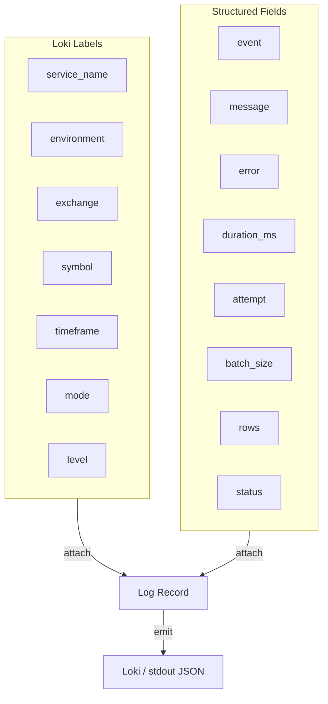

# Creative Phase: Architecture Diagrams

## Overview
Visuals for the TDA Large Collector microservice architecture, showing data flow from exchanges to BigQuery with logging to Loki and scheduling modes.

## System Context
```mermaid
flowchart LR
    U[Operator/Job Runner] -->|CLI args: mode/start/end| App[TDA Collector]
    App -->|REST (ccxt)| Exch[Exchanges]
    App -->|BQ client| BQ[BigQuery<br>market_data_ohlcv]
    App -->|HTTP logs| Loki[Grafana Loki]
    U -->|Container mgmt| Docker[Docker Runtime]
```

## Component Diagram (in-process layering)
```mermaid
flowchart TB
    subgraph CLI["CLI / Entry"]
        Args[mode, start, end, config]
    end

    subgraph Config["Config & Validation"]
        Loader[YAML loader + env overrides]
        Models[Config models]
    end

    subgraph Scheduler["Scheduler / Orchestration"]
        Live[Live loop (interval)]
        History[History pagination loop]
    end

    subgraph Adapter["Exchange Adapter (ccxt)"]
        Factory[ccxt factory (enableRateLimit)]
        Fetch[Fetch OHLCV<br>last 2 bars / paged]
    end

    subgraph Transform["Transform"]
        Normalize[Normalize OHLCV -> schema]
        Time[Timestamp handling (ms -> UTC)]
    end

    subgraph Storage["Storage (BigQuery)"]
        Ensure[Ensure/create table<br>partition+cluster]
        Insert[Streaming inserts<br>insert_rows_json]
    end

    subgraph Telemetry["Logging / Telemetry"]
        Stdout[Structured stdout]
        LokiH[Loki HTTP handler]
    end

    subgraph Resilience["Resilience"]
        Backoff[Exponential backoff + jitter]
        Ratelimit[RateLimit handling]
    end

    Args --> Loader --> Models --> Scheduler
    Scheduler -->|dispatch| Adapter
    Adapter --> Transform --> Storage
    Scheduler --> Telemetry
    Adapter --> Telemetry
    Storage --> Telemetry
    Resilience --> Adapter
    Resilience --> Scheduler
```

## Data Flow (Live vs History)
```mermaid
flowchart LR
    subgraph Live["Mode: LIVE"]
        L1[Tick @ interval] --> L2[Fetch last 2 bars]
        L2 --> L3[Normalize rows]
        L3 --> L4[Insert rows -> BQ]
        L2 --> Llog[Log fetch/metrics]
    end

    subgraph History["Mode: HISTORY"]
        H1[Init window start/end] --> H2[Fetch page (since cursor)]
        H2 --> H3[Normalize page]
        H3 --> H4[Insert page -> BQ]
        H2 --> Hlog[Log page/backoff]
        H4 -->|advance cursor| H2
    end

    L4 --> BQ[(BigQuery)]
    H4 --> BQ
    Llog --> Loki[(Loki)]
    Hlog --> Loki
```

## Logging Taxonomy (visual)


